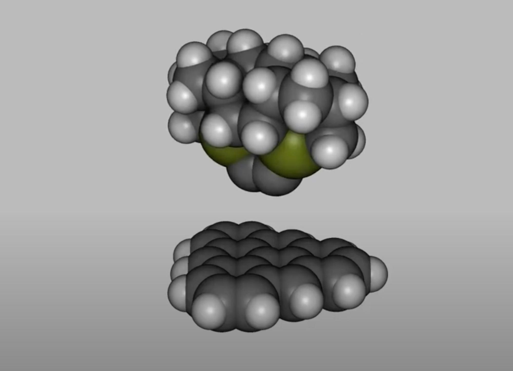
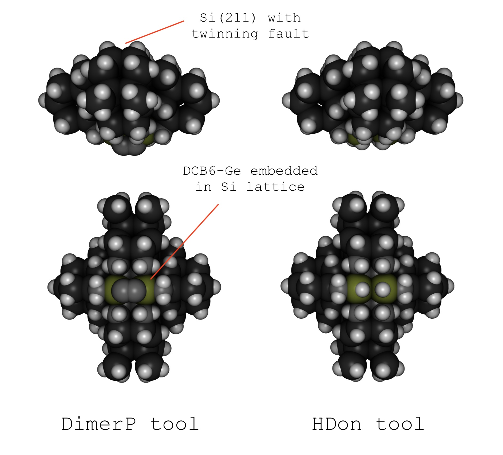
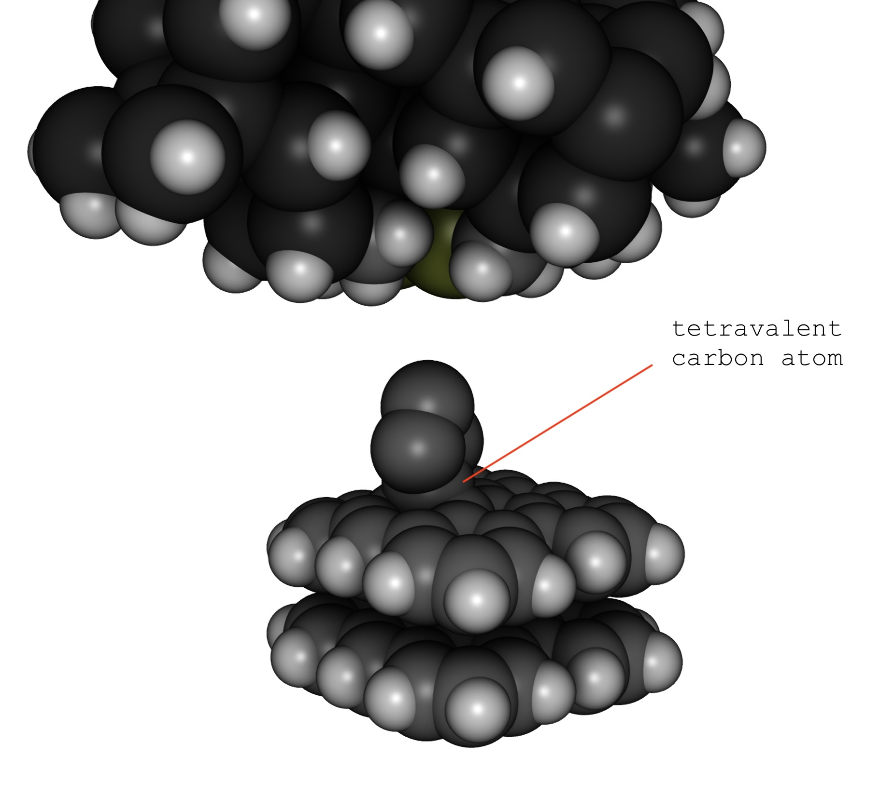
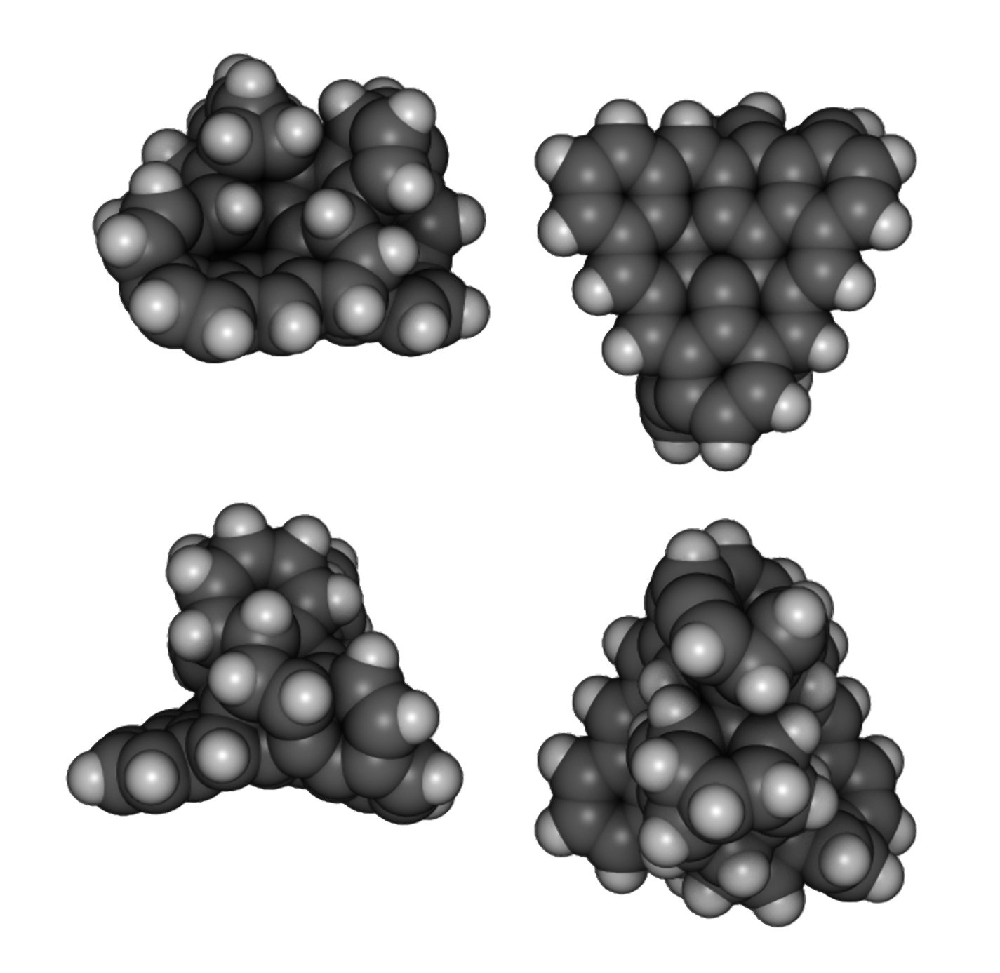

# Mechanosynthetic Build Sequences for Semiconductor Materials with Three Degree of Freedom Nanopositioners

Philip Turner

December 7, 2024

<i>Virginia Tech, NANO 3114</i>

## Abstract

Atomically precise manufacturing procedures were studied for various materials, with the restriction to 3DOF actuators. GFN2-xTB enabled vastly greater simulation speeds than previous studies, while retaining qualitative accuracy in properties besides energy. A large combinatorial space of tooltip types and product materials was explored. Build sequence design relied heavily on automated caching and retrieval of simulation results. While diamond could not be built, aromatic and amorphous carbon could. Silicon mechanosynthesis expanded on previous theoretical studies and established an alternative method of completing the silicon unit cell. Silicon carbide was found to be a more thermodynamically viable material, with similar affinity for 6-membered ring formation. Finally, a silicon carbide tooltip was designed which could perform assisted replication. The study garnered several insights into experimentally accessible methods for building atomically precise products.

## Contents

[Abstract](#abstract)

[Introduction](#introduction)

[Materials and Methods](#materials-and-methods)

[Results and Discussion](#results-and-discussion)

&emsp;[Diamond](#diamond)

&emsp;Silicon

&emsp;Silicon Carbide

Conclusion

## Introduction

The ultimate goal of manufacturing is to build products with atomic precision. As of 2024, the dominant technique for manufacturing small objects is photolithography. Large, intricate chips are manufactured with ~50 nm transistor size (some details within the transistor have ~10 nm resolution). Although marketed as exponentially decreasing with time ("3 nm" and "2 nm" nodes), transistor density is no longer scaling exponentially. For example, the transistor count in four generations of Apple M-series chips increased linearly with time. Moore's Law has ended and we are still nowhere near the atomic level.

Since the 1990s, scanning probe microscopes have repeatedly built atomic-scale structures out of inert feedstocks (Xe, CO, Cl-). Electronics have been manufactured by ripping individual hydrogen atoms off a Si(100) surface, then subjecting the atomically precise pattern to CVD precursor gasses.[^1] To date, no scanning probe has been reported to manufacture 3D structures with a repeating crystal unit cell. The lack of 3D structures stems from the limitations of "conventional mode" atom placement. The scanning probe nudges an atom along a metallic surface, then releases it at the intended destination. To build a 3D structure like a pyramid, the probe would detach the atom from the surface and move upwards in the Z direction. Two chemical reactions must occur reliably&mdash;the atom separates from the surface and binds to the probe, then it migrates from the probe to the build site.

Merkle and Freitas, with investment from Canadian Bank Note, developed an alternative called "inverted mode". Atomically precise nano-tips, about 30 atoms in size, are synthesized with organic chemistry.[^2] Each tip is already charged with a weakly bound feedstock, such as a hydrogen atom. It also contains three linkers that bind to a surface in a tripod configuration. The sample surface is covered with thousands or millions of these nano-tips. Next, a single nano-tip is used to build a single atom onto the scanning probe. Inverted mode simplifies the construction of 3D structures, as only a single chemical reaction is performed to translocate an atom in the Z direction. It also allows the use of reactive feedstocks such as free radicals, which are needed to form covalent bonds.

Before doing experimental research, Merkle and Freitas published a large volume of theoretical research on diamond mechanosynthesis. The largest project was the Minimal Toolset paper.[^3] It proposed 65 reaction sequences that could build both diamond unit cells and replicas of the tools that carried out the reactions. One problem encountered was the formation of 5-membered rings, which disrupt the diamond lattice structure. To circumvent 5-membered ring formation, some critical reactions relied on multiple nanopositioners and/or six degrees of freedom. Existing scanning probes only have a three degree-of-freedom (3DOF) actuator. This experimental limitation brings into question whether diamond can ever be built.

In addition to diamond, there was a body of theoretical literature on silicon mechanosynthesis. In 1997, Herman published a paper about the affinity of silicon for sp3 orbital geometry, and a set of reactions that could build infinite silicon lattices.[^4] This research was promising, as the difficulty building diamond stemmed from carbon's preference for sp2 geometry (e.g. graphite is more stable than diamond). In addition, the unique orbital preferences of silicon allowed the silicon diradical to break apart 5-membered rings. Subsequent papers disclosed reaction sequences that could build silicon unit cells in all crystallographic orientations, and both cubic and hexagonal packing. Nothing of the sort had been published for diamond mechanosynthesis. The content of the papers strongly supported Herman's claim that silicon was ideal for near-term mechanosynthesis with scanning probes.

A limitation of the silicon mechanosynthesis literature was the choice of feedstocks. For example, one feedstock was a bare silicon atom with four dangling bonds. Such a feedstock would likely form a covalent bond with the tooltip presenting it, reducing it to a three-fold radical. One objective of the current paper was adapting Herman's work to feedstocks readily available on tripod nano-tips. To expand the design space for tripods, the designs based on adamantane cages would be generalized to atranes.[^5] The end result would be a refined protocol for building silicon, and highly amenable to experimental validation with existing technology.

## Materials and Methods

Mechanosynthetic reactions were modeled with GFN2-xTB, a semiempirical tight binding simulator by Grimme Lab.[^6] Its main use case is accurately predicting the structure of organometallic complexes, such as organotins. Heavy metal compounds are poorly modeled by most quantum chemical programs, due to relativistic effects and unpaired electrons in the d- and f-shells. Another defining aspect of GFN2-xTB, is that it accurately models geometries, frequencies, and noncovalent forces at the expense of quality in energies. Forces are comparatively easy to model with parameterized Hamiltonians, and forces define the outcome of molecular dynamics simulations. The choice of simulator reflects a recommendation from <i>Nanosystems</i>, Ch. 3.3.1.b, 3.3.2.g, and 3.3.3.[^7] Out of the many parameterized potentials available, choose those that optimize for vibrational frequencies, when analyzing stiff diamondoid structures.

Previous literature used methods such as B3LYP with a Gaussian basis set. These methods, although called "ab initio", are not derived directly from the laws of physics. They employ pseudopotentials and Slater &rarr; Gaussian curve fittings that only generalize within a narrow range of known compounds. The parameterization requires pre-existing data on electron probability distributions in 3D space. Their distinction from "semiempirical" methods reduces to how many components of the calculation use artificial parameters to avoid solving the (computationally expensive) underlying physical equations. Compared to "ab initio" methods, xTB makes drastic optimizations that reduce the time to solve electronic structures. A singlepoint force evaluation of a ~50 atom system takes ~100 ms with xTB, versus ~10 minutes with B3LYP. The multiple orders of magnitude lower latency enabled techniques rarely seen in previous literature, such as long-time molecular dynamics. A chemical reaction could be simulated on a quasi-static trajectory in ~1000 timesteps, taking only ~3 minutes. When designing build sequences, the 3-minute feedback loop allowed ~50 reactions to be attempted in a single day.

For energy minimizations, the FIRE algorithm was used. Its similarity to molecular dynamics made it easy to code and optimize. Structural relaxations were considered converged when each atom experienced under 10 piconewtons of force, and terminated if convergence did not happen within 500 timesteps. This scheme converged most structures to within 0.01 eV of the energy minimum. Minimized structures were saved on disk in a key-value cache. The key was a 384-bit hash generated from the structure's atom coordinates and atomic numbers. The value was the atom coordinates during every timestep of the minimization. One could compile the pre-minimization structure, retrieve the final timestep from the cache, and query its energy with one singlepoint evaluation. This capability allowed a tooltip to be used in several program launches, while only incurring the latency of minimization the first time the computer program was launched.

Binding energy: EAB - EA - EB (typically negative)

Removal energy: EA + EB - EAB (typically positive)

<i><b>Equation 1.</b> Formulae used to compute feedstock binding energy and removal energy.</i>

The data from energy minimizations served two purposes: checking structural stability and comparing the energies of different structures. One could grossly perturb a structure and watch an animation of the minimization timesteps. Unstable structures would experience ruptures in covalent bonds, or changes in geometry indicating a change in hybridization. For example, a carbene diradical would easily insert into a nearby C-Si bond. Regarding energies, the most common use case was feedstock binding energy. Three structures were compiled and modeled as isolated systems: the charged tool (AB), the spent tool (A), and the dissociated feedstock (B). The binding energy (Equation 1) was the energy change when the latter two systems formed a covalent bond.

Binding energies were primarily used to analyze different tools binding the same feedstock. For example, two exemplary thermodynamic cascades are shown (Figures 1&ndash;2). During the tin cascade, methylene transfers from the Sn tool, to the Ge tool, to the Si tool. Each transition ends with the system in a lower-energy state. During the germanium cascade, the second transition has no net energy decrease. The germanium cascade is not thermodynamically favorable. One would conduct this analysis when deciding whether to use Sn tripods or Ge tripods to initiate a thermodynamic cascade.

| C3Sn-CH2&middot; | &rarr; | C3Ge-CH2&middot; | &rarr; | C3Si-CH2&middot; |
| :-: | :-: | :-: | :-: | :-: |
| -3.70 eV |   | -4.72 eV |   | -5.36 eV |

<i><b>Figure 1.</b> Thermodynamic cascade for methylene transfer, starting from tin.</i>

| C3Ge-CH2&middot; | &rarr; | C3Si-CH2&middot; | &rarr; | C3Si-CH2&middot; |
| :-: | :-: | :-: | :-: | :-: |
| -4.72 eV |   | -5.36 eV |   | -5.36 eV |

<i><b>Figure 2.</b> Thermodynamic cascade for methylene transfer, starting from germanium.</i>

## Results and Discussion

| Element | H        | C        | Si       | Ge       |
| :------ | -------: | -------: | -------: | -------: |
| H       | -5.33 eV |          |          |          |
| C       | -5.29 eV | -5.27 eV |          |          |
| Si      | -4.72 eV | -4.38 eV | -3.10 eV |          |
| Ge      | -4.01 eV | -3.59 eV | -2.96 eV | -2.86 eV |
| Sn      | -3.29 eV | -2.67 eV | -2.34 eV | -2.39 eV |

<i><b>Table 1.</b> Matrix of bond energies between the elements found in diamond-like materials. Bonds between group IV elements are based on the model system C3Si-SiH3. The two innermost atoms (silicons, in this case) are replaced with the matrix row and column. More positive energies indicate a weaker bond (e.g. Sn-H is weaker than C-H).</i>

The research resulted in four manually designed build sequences, each building a ~30 atom product with ~50 reactions. A total of 1,225 permutations of tripods were analyzed and stored in a large key-value cache (108 MB). With the atom coordinates of these tripods and several variants of the DCB6-Ge tooltip, the author generated 51 energy tables. The tables assisted in build sequence design and various feasibility analyses. Table 1 summarizes the tables used during research.

While conducting the research, the author created 27,000 lines of Swift code. A large portion of the code was for compiling tips and setting up simulations. In addition, some tooltips and product structures were serialized as array literals in the source code. The author organized this code into a GitHub repository ([philipturner/bootstrapping-code-archive](https://github.com/philipturner/bootstrapping-code-archive)). The repository's overview contains the energy tables, formatted as GitHub Markdown.

The author created multiple animations to illustrate tooltips and mechanosynthetic reactions. They are freely available and published on YouTube (Table 2).

| Number | Link | Description |
| :----: | ---- | ----------- |
| 1 | [youtu.be/whvXCeEwlmI](https://youtu.be/whvXCeEwlmI) | DCB6-Ge tooltip successfully places a carbon dimer onto a build plate in the horizontal position. Then, it executes three additional reactions. |
| 2 | [youtu.be/46iEIYD8eBE](https://youtu.be/46iEIYD8eBE) | Showcase of 52 tripod nano-tips, whose (molecular dynamics-like) trajectory for energy minimization was saved in a cache. Shows the unique atrane cage structure required for organotin tooltips. |
| 3 | [youtu.be/lbxKyF2mLTQ](https://youtu.be/lbxKyF2mLTQ) | Playback of the 48 different reactions in a silicon build sequence. The reactions were individually debugged and collected in a cache over a ~5-day period. |

<i><b>Table 2.</b> Listing of the videos published as part of this research project.</i>

### Diamond

The first build sequence used the DCB6-Ge tooltip, which holds carbon dimer feedstocks (Figure 3). Binding energies revealed that the tip could also place hydrogen atoms, boron dimers, and phosphorus dimers. It was embedded in a ~200 atom cluster model of a Si lattice, to permit structural relaxations (Figure 4). The model was large enough to simulate tip destruction when crashing into a surface. The workpiece was a graphite surface, modeled by a 33-atom cluster model with hydrogen termination. Upon application of the tooltip, carbon dimers almost always rotated from horizontal to vertical ("carbenic rearrangement" in previous literature). It took three design iterations to find a build plate that accepted the dimer in the horizontal orientation. Additional dimers could be placed if they formed a covalent bond with the first dimer.

&nbsp;
  
&nbsp;

<i><b>Figure 3.</b> Space-filling render of the DCB6-Ge tooltip. Germanium atoms are green, carbons are gray, and hydrogens are white. The tool is embedded in a ~20-atom cluster model of a diamond lattice. The carbon dimer is the pair of carbons directly below the germanium atoms, which are not connected to any hydrogens.</i>

&nbsp;
  
&nbsp; &nbsp;
  
&nbsp;

<i><b>Figure 4.</b> Molecular model of the dimer tool. The core (~20 atoms) was modeled with the expensive GFN2-xTB Hamiltonian. The periphery (~200 atoms) was modeled with the cheap GFN-FF Hamiltonian. The two regions were simulated together in a multiscale MD simulation.</i>

While growing the product structure, the interactions between C2 and H feedstocks were revealed. Carbons accepted hydrogens when they had the sp hybridization (alkyne), but not the sp2hybridization (alkene). To form diamond, one must promote a carbon from sp to sp2 to sp3. The lack of hydrogen affinity during the sp2 stage made sp3 rich products difficult to grow. Second, the most common site accepting a C2 was a pair of opposing carbon monoradicals. Each one would form a covalent bond with an opposing end of the dimer. These behaviors made the construction of vertically oriented graphitic sheets relatively easy.

Although 2D graphene lattices could be formed, the intention was to build 3D structures. Diamond could not be built. The product contained many 6-membered rings and cages, although not a pristine diamond lattice (Figure 5). Pathological 3-, 4-, and 5-membered rings were unavoidable. Forming such rings was often the only way to promote carbons from sp2 to sp3. In addition, many reactions required the tool to approach from a sideways angle (Table 3). Hence, the nanopositioner had 1&ndash;2 rotational DOFs and 4&ndash;5 DOFs overall.

&nbsp;
  
&nbsp;

<i><b>Figure 5.</b> Product of the diamond build sequence, viewed from four different angles. The large triangular component is the remnant of the 33-carbon graphene nanoribbon.</i>

| Reaction | Count | Proportion of Sequence |
| :------- | ----: | ---------------------: |
| HAbst            | 19          | 31%          |
| HDon             | 3           | 5%           |
| H2Don            | 18          | 29%          |
| C2               | 20          | 32%          |
| Rearrangement    | 2           | 3%           |
| Total (Tilted\*) | 21&ndash;37 | 34&ndash;60% |
| Total            | 62          | 100%         |

<i><b>Table 3.</b> Summary of the build sequence for diamond-like carbon. \*The tooltip had to be rotated away from pointing straight down. The number of tilted reactions was uncertain, as the hydrogen abstractions could not be directly simulated.</i>

[^1]: Rudolph, M.; Carr, S. M.; Subramania, G.; Ten Eyck, G.; Dominguez, J.; Pluym, T.; Lilly, M. P.; Carroll, M. S.; Bussmann, E. (<b>2014</b>). Probing the limits of Si:P &delta;-doped devices patterned by a scanning tunneling microscope in a field-emission mode. <i>Applied Physics Letters, 105</i>(16), 163110. https://doi.org/10.1063/1.4899255

[^2]: Merkle, R. C.; Freitas, R. A. Jr.; Barton, J.; Hill, A.; Drew, M.; Allis, D.; Takatani, T.; McCallum, T.; Mamone, M.; Zindy, N.; Tanveer, K. (<b>2023</b>). Systems and methods for mechanosynthesis. <i>United States Patent and Trademark Office,</i> Patent No. 11708384B2. https://patents.google.com/patent/US11708384

[^3]: Freitas, R. A.; Merkle, R. C. (<b>2008</b>). A Minimal Toolset for Positional Diamond Mechanosynthesis. <i>Journal of Computational and Theoretical Nanoscience, 5</i>(5), 760&ndash;861. https://doi.org/10.1166/jctn.2008.2531

[^4]: Herman, A. (<b>1997</b>). Towards mechanosynthesis of diamondoid structures: I. Quantum-chemical molecular dynamics simulations of sila-adamantane synthesis on hydrogenated Si(111) surface with the STM. <i>Nanotechnology, 8</i>(3), 132&ndash;144. https://doi.org/10.1088/0957-4484/8/3/006

[^5]: Verkade, J. G. (<b>1994</b>). Main group atranes: chemical and structural features. <i>Coordination Chemistry Reviews, 137,</i> 233&ndash;295. https://doi.org/10.1016/0010-8545(94)03007-D

[^6]: Bannwarth, C.; Ehlert, S.; Grimme, S. (<b>2019</b>). GFN2-xTB&mdash;An Accurate and Broadly Parametrized Self-Consistent Tight-Binding Quantum Chemical Method with Multipole Electrostatics and Density-Dependent Dispersion Contributions. <i>Journal of Chemical Theory and Computation, 15</i>(3), 1652&ndash;1671. https://doi.org/10.1021/acs.jctc.8b01176

[^7]: Drexler, K. E. (<b>1991</b>). Molecular machinery and manufacturing with applications to computation. <i>DSpace@MIT.</i> https://dspace.mit.edu/handle/1721.1/27999
